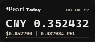
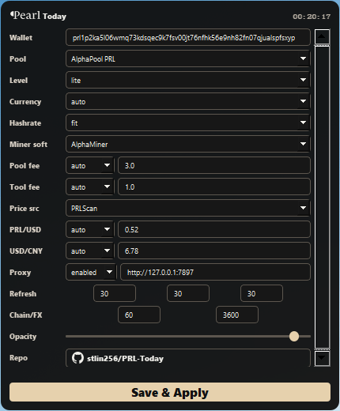

# PRL-Today

[](https://github.com/stlin256/PRL-Today/releases)
[](https://github.com/stlin256/PRL-Today/releases)
[](https://www.python.org/)
[](https://pyinstaller.org/)

PRL-Today is a small always-on-top Windows floating window for tracking today's Pearl (PRL) mining revenue in real time.

It reads live miner, pool, market, network, and FX data, then displays a continuously moving 6-decimal estimate. The primary currency is selected automatically: Chinese system locales show CNY first, while other locales show USD first.

## Features

- Floating Qt desktop window with frameless, translucent, always-on-top behavior.
- First-run setup guide for wallet address, pool, mining software, price source, proxy, and display options.
- Slot-machine style rolling number animation for the main revenue value.
- PRL-inspired dark pearl visual theme and bundled app icon.
- Stable-width primary and secondary values to avoid layout jitter while numbers change.
- Miner/pool/market refresh scheduler instead of one global polling interval.
- Configurable display levels: `lite`, `standard`, and `detail`.
- Built-in PRL mining pool presets from Hashrate.no, including AlphaPool, Kryptex, Pearlhash, Luckypool, JETSKI, BaikalMine, akoya, Himpool, NushyPool, Mineprl, and HeroMiners.
- Built-in PRL miner presets from Hashrate.no and current public miner docs:
  - AlphaMiner, pearl algorithm, 0.00% developer fee from the official v1.7.7+ release.
  - lpminer, pearlhash algorithm, 0.00% developer fee.
  - BzMiner, pearl algorithm, 2.00% developer fee for the current CPU-only Pearl beta.
  - SRBMiner, pearlhash algorithm, 3.00% developer fee.
- Price source selection:
  - SafeTrade public ticker API by default.
  - PRLScan.
  - SafeTrade mirror endpoints.
  - SafeTrade exchange page fallback.
- Optional proxy support.

## Download

Download the latest Windows build from the [GitHub Releases](https://github.com/stlin256/PRL-Today/releases) page.

On first launch, PRL-Today opens the setup panel automatically. Enter your wallet address, select the pool/mining software/price source, then save.

## Screenshots





## Data Refresh

- UI rolling value: every 1 second.
- Miner wallet data: every 30 seconds.
- Pool stats: every 30 seconds.
- PRL/USD market price: every 30 seconds.
- Chain/network summary: every 60 seconds.
- USD/CNY FX rate: every 3600 seconds.

## Revenue Formula

```text
projected_24h_prl =
  miner_hashrate / network_hashrate
  * (86400 / average_block_time_seconds)
  * block_reward
  * (1 - pool_fee_percent)
  * (1 - mining_software_fee_percent)

today_prl =
  max(observed_today_prl, projected_24h_prl * elapsed_seconds_today / 86400)

today_usd = today_prl * PRL/USD
today_cny = today_usd * USD/CNY
```

The default hashrate mode is `fit`, which uses the miner hashrate series and a bounded linear fit. You can also select `miner_1h`, `miner_24h`, or `worker_live`.

## Running From Source

```powershell
git clone https://github.com/stlin256/PRL-Today.git
cd PRL-Today
python -m pip install -e .
python run.py
```

Run a one-shot live data check without opening the GUI:

```powershell
python run.py --check
```

If your default Python cannot import Qt, install the project dependencies in that environment or set `PRL_TODAY_PYTHON` to a Python executable that has PyQt installed.

## Windows Build

```powershell
python -m pip install -e ".[build]"
python -m PyInstaller PRL-Today.spec --noconfirm --clean
python scripts/package_release.py --platform windows --arch x64 --output release
```

The PyInstaller build output is a single executable:

```text
dist\PRL-Today.exe
```

For releases, upload the archive created under `release\`.

Cross-platform release packaging is documented in [docs/release.md](docs/release.md). The GitHub Actions release workflow builds Windows x64, macOS x64, macOS arm64, and Linux x64 artifacts on native runners.

## Configuration

Settings are saved to `config.json`, which is intentionally ignored by Git.

The setup panel lets you configure:

- Wallet address.
- Pool preset.
- Mining software preset and developer fee.
- Pool fee mode.
- Price source and manual price fallback.
- USD/CNY source and manual FX fallback.
- Proxy.
- Refresh intervals.
- Display currency and detail level.

## Tests

```powershell
python -m unittest discover -s tests
python -m compileall src tests
```

## Notes

- AlphaPool is currently the only bundled pool preset with live miner/pool API paths wired by default.
- Other pool presets are included for fee and metadata convenience; they can be extended with API paths later.
- AlphaMiner fee follows the official AlphaMiner release metadata because third-party miner tables can lag behind releases.
- SafeTrade can reject direct requests in some network environments. Use the proxy setting if needed.

## Donation

If this tool is useful to you, donations are appreciated:

```text
prl1p2ka5l06wmq73kdsqec9k7fsv00jt76nfhk56e9nh82fn07qjualspfsxyp
```
